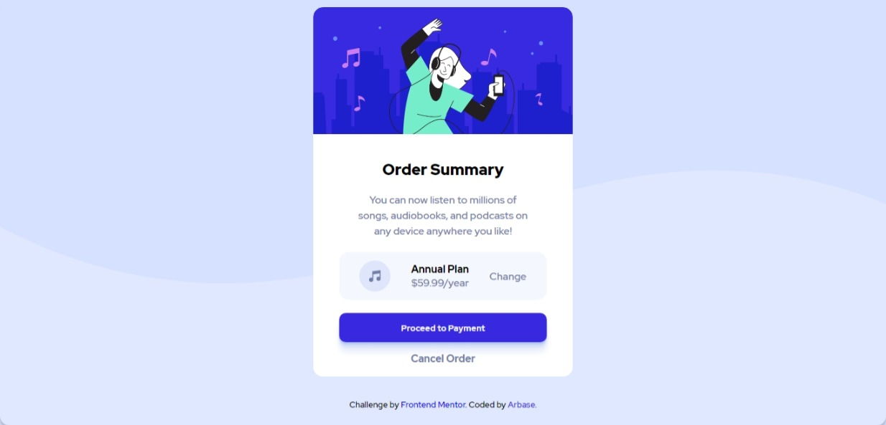

[](https://app.netlify.com/sites/cocky-wing-31e842/deploys)

# Frontend Mentor - Order summary card solution

This is a solution to the [Order summary card challenge on Frontend Mentor](https://www.frontendmentor.io/challenges/order-summary-component-QlPmajDUj). Frontend Mentor challenges help you improve your coding skills by building realistic projects.

## Table of contents

- [Overview](#overview)
  - [The challenge](#the-challenge)
  - [Screenshot](#screenshot)
  - [Links](#links)
- [My process](#my-process)
  - [Built with](#built-with)
  - [What I learned](#what-i-learned)
  - [Useful resources](#useful-resources)
- [Author](#author)
- [Acknowledgments](#acknowledgments)

## Overview

Order summary card solution by arbase, I made this using CSS Flexbox and CSS Grid.

### The challenge

Users should be able to:

- See hover states for interactive elements

### Screenshot



### Links

- Solution URL: [frontendmentor.io solution](https://www.frontendmentor.io/challenges/order-summary-component-QlPmajDUj/hub/mobile-first-and-responsive-order-summary-card-fBUxdWhrw)
- Live Site URL: [Order Summary - Netlify](https://cocky-wing-31e842.netlify.app/)

## My process

I managed to finish this project in 2 days and it's quite accomplishment for me

### Built with

- Semantic HTML5 markup
- Flexbox
- CSS Grid
- Mobile-first workflow

### What I learned

I managed to finish this project after I learn about CSS Grid and Flexbox.

```css
body {
  height: 100vh;
  width: 100vw;
  display: flex;
  flex-wrap: wrap;
  flex-shrink: 0;
  align-items: center;
  justify-content: center;
}
```

### Useful resources

- [Mozilla Developer - CSS Felxbox](https://developer.mozilla.org/en-US/docs/Web/CSS/CSS_Flexible_Box_Layout/Basic_Concepts_of_Flexbox) - This helped me for understanding CSS Flexbox.

## Author

- Website - [Aroyan](https://www.aroyanbakti.com)
- Frontend Mentor - [@aroyan](https://www.frontendmentor.io/profile/aroyan)
- Twitter - [@aroyanbaktis](https://www.twitter.com/aroyanbaktis)

## Acknowledgments

Thanks for Mozilla Dev for providing resource for CSS Flexbox and for Twitter community who help me a lot.
